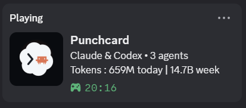
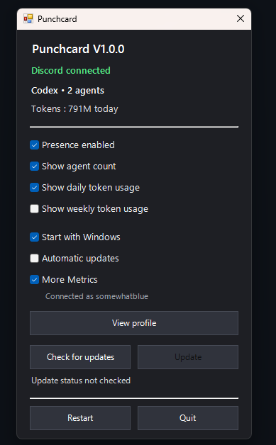
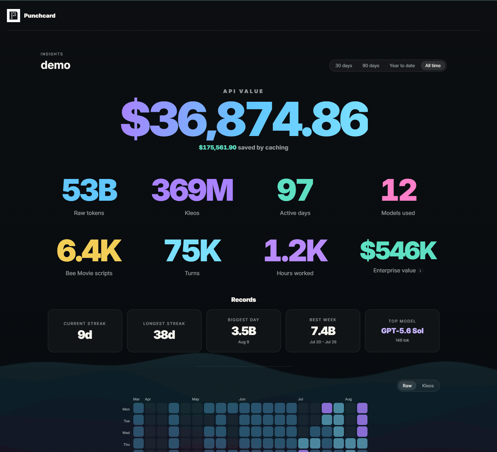

<p align="center">
  
</p>

# Punchcard

Punchcard is a completely free, lightweight Discord Rich Presence for your Agentic Development Environments (ADEs). No API key, account, or setup is required. It shows when you are working with an ADE, how many agents are active, and how many tokens you have used.

<p align="center">
  
</p>

## Installing

Requires [Node.js 18 or newer](https://nodejs.org/) and the Discord desktop app.

```sh
npm install -g punchcard-presence
```

If you would prefer to use an agent or AI, paste this:

```text
Read https://github.com/TheFysionX/punchcard and install Punchcard.
```

Punchcard starts automatically after installation.

### Supported platforms

- Codex
- Claude

Support for more ADEs is planned for the immediate future.

## Features

- Discord Rich Presence for Codex, Claude, or both at once
- Active agent count
- Daily and weekly token usage
- Optional profile link on the Discord token line
- Automatic Discord reconnection
- Native Windows tray controls and login startup
- Local-first tracking of usage and activity

## Commands

| Command | Description |
| --- | --- |
| `punchcard on` | Enable and start Punchcard |
| `punchcard off` | Stop Punchcard and remove its startup entry and Claude hooks |
| `punchcard quit` | Close Punchcard without changing the Start with Windows setting |
| `punchcard toggle` | Switch Punchcard on or off |
| `punchcard connect` | Open Discord if needed and reconnect Punchcard |
| `punchcard status` | View the current connection, agent, and usage status |
| `punchcard doctor` | Print diagnostic status information |
| `punchcard restart` | Restart the daemon and tray |
| `punchcard tray --show` | Open the Windows mini dashboard |
| `punchcard startup <on\|off\|status>` | Manage Start with Windows |
| `punchcard auto-update <on\|off\|status>` | Manage automatic updates |
| `punchcard display status` | Show all Discord display settings |
| `punchcard display <agents\|daily\|weekly> <on\|off\|status>` | Manage the agent count and token totals shown in Discord |
| `punchcard more-metrics <on\|off\|status>` | Manage the optional Advanced Metrics extension from the CLI |
| `punchcard profile [--base-url URL]` | View the profile status or configure its host |
| `punchcard profile-link <on\|off\|status>` | Control whether the Discord token line links to your profile |
| `punchcard update-check` | Check for a newer version |
| `punchcard update` | Install the newest available version |
| `punchcard app [--id ID]` | View or change the Discord application ID |
| `punchcard --version` | Print the installed version |
| `punchcard help` | Show command-line help |

Add `--json` to `connect`, `status`, `display`, `more-metrics`, `profile`, or `update-check` for machine-readable output.

## Advanced Metrics

Advanced Metrics is optional, disabled by default, and distributed separately from the core presence package.

Open the Punchcard mini dashboard from the Windows tray and click the **More Metrics** checkbox highlighted below.

<p align="center">
  
</p>

Punchcard installs [`punchcard-advanced-metrics`](https://www.npmjs.com/package/punchcard-advanced-metrics) in the background. Once connected, click **View profile** to open your dashboard. The companion package is maintained separately and is not part of this repository.

After More Metrics is enabled, Punchcard shows a nested **Show my profile in my status** checkbox. It is off by default. Enabling it makes the token line in Discord clickable and sends people to your Punchcard profile. When it is off, Punchcard does not include a profile URL in the Discord activity.

<p align="center">
  
</p>

To disable Advanced Metrics, clear the **More Metrics** checkbox in the mini dashboard.

Punchcard is independent and is not affiliated with Anthropic, OpenAI, or Discord. Released under the [MIT License](LICENSE).
